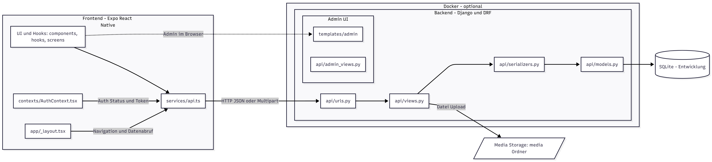

## EisenachApp – Überblick und Start

Diese App habe ich im Rahmen meiner Seminarfacharbeit am Ernst‑Abbe‑Gymnasium Eisenach entwickelt. In der Arbeit erkläre ich Konzept, Ziele, Architektur und technische Entscheidungen ausführlicher. Wer tiefer einsteigen möchte, kann die Dokumentation hier öffnen: [Seminarfacharbeit (PDF)](Seminarfacharbeit.pdf).

### Kurz‑Einleitung (aus der Seminarfacharbeit)
In Eisenach gibt es viele Jugendangebote – von Sportvereinen über Jugendclubs bis zu Workshops. Das Problem: Informationen sind oft verstreut, unübersichtlich oder schwer auffindbar. Weil fast alle Jugendlichen ihr Smartphone nutzen, entwickle ich eine App, die Angebote bündelt und die Teilnahme einfacher macht.

Als Grundlage habe ich die bestehenden Angebote systematisch erhoben und analysiert (Nutzung, Zugänglichkeit, Alterszielgruppen, Kosten). Zusätzlich binde ich die beteiligten Gruppen ein: Träger und Organisatoren auf der einen Seite sowie Jugendliche auf der anderen – unter anderem per Umfrage.

Aus den Befunden leite ich Anforderungen ab: personalisierte Empfehlungen, Kalenderfunktionen, direkte Event‑Anmeldung, Vernetzung mit Freund:innen und eine einfache Kommunikation zwischen Jugendlichen und Anbietern. Ziel ist, die Plattform prototypisch zu testen, Reichweite und Teilnahme zu erhöhen und gleichzeitig Hürden sowie Lücken im Eisenacher Jugendangebot sichtbar zu machen.

### Was ist das?
Nichtkommerzielle Jugendplattform zum Thema „Aktuelle und zukünftige Stadtentwicklung in Eisenach und ihr Einfluss auf Aktivitäten für Jugendliche“. Technischer Stack: React Native (Expo) fürs Frontend und Django REST fürs Backend.

### Projektstruktur (Kurzüberblick)
- `backend/`: Django-Projekt (API + Admin)
  - `eisenach_backend/`: Django Settings/URLs
  - `api/`: Modelle, Views, URLs der REST-API und Custom-Admin-Dashboard
  - `templates/admin/`: Templates für das Admin-Dashboard
  - `static/`: projektinterne statische Dateien (z. B. Logos)
  - `staticfiles/`: Ausgabeverzeichnis für `collectstatic` (wird in DEBUG per URL `/static/` ausgeliefert)
  - `media/`: hochgeladene Medien (z. B. Avatar-/Eventbilder)
  - `manage.py`: Django CLI
  - `config.py`: zentrale Entwicklungs-Konfiguration (Hosts, CORS, Basis-URLs)
- `frontend/EisenachApp_0.0.1/`: Expo-App
  - `app/`: Routen (expo-router), Tabs, Screens
  - `components/`: UI-Komponenten (Karten, Inputs, Auth, Profile, …)
  - `services/`: API-Aufrufe zum Backend
  - `config/`: API-Basis-URL (automatisch aus der Expo-Host-IP abgeleitet)
  - `constants/`, `contexts/`, `hooks/`: Theme, Auth, Hilfsfunktionen
  - `assets/`: Bilder
- `start-app.bat`: Windows-Hilfsskript (startet Backend, prüft Health, startet Expo)

### Wichtige URLs
- API: `http://<PC-IP>:8000/api/` (z. B. `…/api/health/`)
- Admin klassisch (Login): `http://<PC-IP>:8000/admin-classic/`
- Custom Admin-Dashboard: `http://<PC-IP>:8000/admin/` (leitet bei Bedarf automatisch zum klassischen Login weiter)
- Medien: `http://<PC-IP>:8000/media/...`

### Abhängigkeiten
Ohne Docker:
- Python 3.11
- Node.js (LTS) und npm
- Optional: Java (Android-Emulator), Xcode (iOS)

Python-Pakete (siehe `backend/requirements.txt`):
- u. a. Django, djangorestframework, django-cors-headers, dj-database-url

Mit Docker:
- Docker Desktop (aktuell)
- docker-compose

### Start (ohne Docker)
1) Backend
   - Windows PowerShell:
     ```bash
     cd backend
     # Falls noch nicht vorhanden: python -m venv venv
     venv\Scripts\activate
     pip install -r requirements.txt
     python manage.py migrate
     python create_superuser.py  # legt einen Admin an
     python manage.py runserver 0.0.0.0:8000
     ```
   - Admin öffnen: `http://<PC-IP>:8000/admin/` (Login erfolgt über `admin-classic/`)
     Hinweis: `<PC-IP>` = IPv4 deines Rechners im WLAN (z. B. 192.168.x.y). Android-Emulator: `10.0.2.2` als Host.

2) Frontend (neue PowerShell)
   ```bash
   cd frontend\EisenachApp_0.0.1
   npm install
   npm start
   ```
   Expo im LAN-Modus nutzen (Gerät im gleichen WLAN). Die App ermittelt die Host-IP automatisch aus der Expo-Umgebung.

Alternativ: `start-app.bat` im Projektwurzelverzeichnis ausführen (Windows). Das Skript:
- startet das Backend,
- prüft `GET /api/health/`,
- erstellt optional Testdaten,
- startet danach Expo (`npm start`).

### Start (mit Docker) – Kurz
1) `.env`/Konfiguration prüfen (falls nötig)  
2) `docker-compose up --build`  
3) Backend läuft auf Port 8000. Das Frontend wird i. d. R. mit Expo lokal entwickelt.

### Kurze App-Beschreibung
- Feed: Öffentliche Events (ohne Anmeldung sichtbar)
- Event-Details: Öffentlich; Teilnahme/Kommentare nur angemeldet
- Freunde: nur angemeldet
- Event einreichen: nur angemeldet
- Profil: Login/Profil; Profilbild-Upload; Datenschutzeinstellungen

### Architektur – einfach erklärt
So funktioniert die App „von vorne nach hinten“ – einmal in normalem Deutsch, so wie ich es im Unterricht erklären würde:

<p align="center">
  
</p>

- **Frontend (Expo React Native)**
  - UI und Logik liegen in `frontend/EisenachApp_0.0.1/app/` (Screens) und `components/` (Bausteine).
  - `contexts/AuthContext.tsx` hält meinen Anmeldestatus und das Token bereit.
  - `app/_layout.tsx` steuert die Navigation und stößt Datenabrufe an.
  - Die eigentlichen Requests macht `services/api.ts` – entweder JSON oder Multipart (für Datei‑Uploads).
  - Die Basis‑URL (`http://<IP>:8000/api`) wird in `config/api.ts` automatisch aus der Expo‑Host‑IP ermittelt.
  - Das Admin‑Interface rufe ich getrennt im Browser auf (siehe Backend).

- **Schnittstelle (HTTP/JSON)**
  - Die App schickt eine Anfrage wie `GET /api/events/` oder `POST /api/events/`.
  - Antwort ist eigentlich immer JSON; bei Uploads wird zusätzlich eine Bild‑Datei übertragen.

- **Backend (Django + Django REST Framework)**
  - Routing: `backend/api/urls.py`.
  - Logik/Validierung: `backend/api/views.py`.
  - Datenschutz & Form: `backend/api/serializers.py`.
  - Persistenz/Tabellen: `backend/api/models.py` (in der Entwicklung mit SQLite).
  - Medien: Uploads werden nach `backend/media/` gespeichert und sind über `http://<IP>:8000/media/...` erreichbar.
  - Admin UI: Browser‑Ansicht mit `templates/admin/` (HTML) und `api/admin_views.py` (Funktionen).
  - Admin‑Pfad: klassisch `http://<IP>:8000/admin-classic/`, mein Dashboard unter `http://<IP>:8000/admin/`.
  - Docker ist optional – ich kann Backend und DB damit kapseln, muss aber nicht.

- **Ablauf in 6 Schritten (Beispiel: Event erstellen)**
  1. Nutzer füllt in der App ein Event‑Formular aus und drückt „Senden“.
  2. Die UI ruft `submitEventDraft(...)` in `services/api.ts` auf.
  3. Der Service baut die Anfrage (mit Token und ggf. Bild) und schickt `POST /api/events/` an das Backend.
  4. `api/urls.py` leitet auf die passende View in `api/views.py` weiter, die Daten prüft und speichert (über `models.py`).
  5. Bei einem Bild wird die Datei in `media/` abgelegt; die Antwort enthält dann die fertige Bild‑URL.
  6. Das Backend antwortet mit JSON, und die App aktualisiert die Oberfläche (neues Event erscheint im Feed).

- **Warum das so praktisch ist**
  - Frontend und Backend sind klar getrennt – ich kann beides unabhängig entwickeln und testen.
  - Durch JSON‑Schnittstellen bleibt die App flexibel (z. B. spätere Web‑Clients).
  - Sicherheit: Nur angemeldete Nutzer dürfen sensible Aktionen ausführen (Token im Header).

### Hinweise für die Entwicklung
- IP-Erkennung im Frontend: Die API-URL wird automatisch aus der Expo-Host-URI gebaut (`http://<host>:8000/api`). Bei WLAN-Wechsel ist keine manuelle Anpassung nötig. Falls doch, kann in `frontend/EisenachApp_0.0.1/config/api.ts` eine feste Basis-URL gesetzt werden.
- Backend-Debug/CORS: In `backend/config.py` wird `debug` standardmäßig auf `False` gesetzt. Bei `True` erlaubt das Backend in den Settings (`ALLOWED_HOSTS='*'` + großzügige CORS) den Zugriff aus dem LAN für einfaches Testen. Für Produktion unbedingt auf `False` lassen.
- Statische Dateien: Eigene Dateien liegen in `backend/static/`. Ausgeliefert werden sie in der Entwicklung über `/static/` aus `backend/staticfiles/`. Falls etwas fehlt, einmal `python manage.py collectstatic` ausführen (oder das Startskript/Docker-Setup nutzen).
